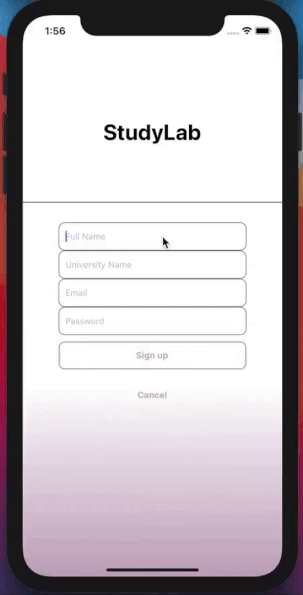
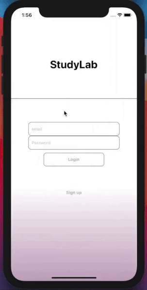
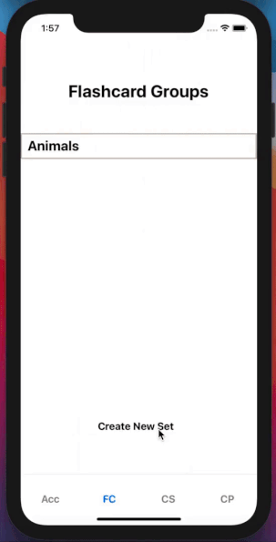
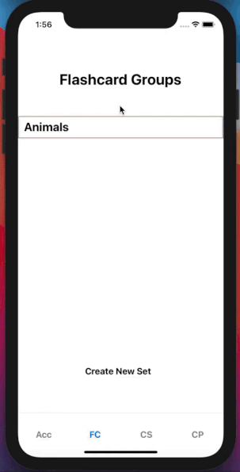
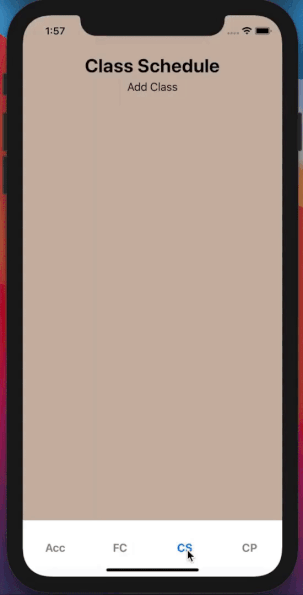
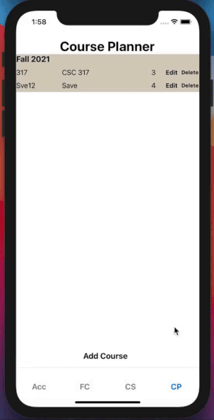

<h2 align="center">StudyLab</h2>

SF Hacks 2021

### [Check out our Devpost with more information about the project](https://devpost.com/software/studylab)

### What is StudyLab?

**StudyLab is an IOS application designed to help college students study and remain organized.**

- Users can **sign up and login** to their accounts
- Users can **set reminders** regarding upcoming classes
- Users can **plan their courses and keep track of their units** using the course planner
- Users can **create different sets of flashcards** and use them to study

### [Video](https://youtu.be/afOXtdzvCwE) and GIFS

  

    <h3 align="center">Signing up</h3>
    

      
    

  

  

    <h3 align="center">Logging in</h3>
    

      
    

  

  

    <h3 align="center">Creating Flashcards</h3>
    

      
    

  

  

    <h3 align="center">Studying Flashcards</h3>
    

      
    

  

  

    <h3 align="center">Reminders</h3>
    

      
    

  

  

    <h3 align="center">Course Planner</h3>
    

      
    

  

<h3 align="center">Built using React Native, ExpressJS and MongoDB<h3>
